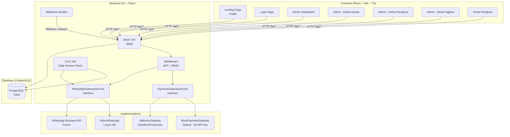

# Q-TA (QRIS Terintegrasi & Andal) — Implementation Plan

Sistem digitalisasi pencatatan, penagihan, dan pelaporan keuangan untuk pemilik usaha kos-kosan (UMKM akomodasi) di Indonesia. Menggantikan pencatatan manual dengan dasbor terpusat, pembayaran QRIS sandbox, pengingat otomatis (simulasi), dan pemisahan otomatis pendapatan bersih vs titipan pajak.

**Project Path:** `C:\Users\Acer\.gemini\antigravity\scratch\q-ta`

---

## User Review Required

> [!IMPORTANT]
> **Payment Gateway Choice: Midtrans Core API (Sandbox)**
> Saya memilih Midtrans Core API (bukan Snap) agar QR code bisa di-render langsung di UI kita — memberikan kontrol penuh atas tampilan. Untuk demo, sistem akan menggunakan **mock payment gateway** yang mensimulasikan response Midtrans tanpa perlu API key asli, sehingga `docker-compose up` langsung jalan. Kode integrasi Midtrans asli sudah disiapkan dan tinggal diaktifkan via `.env`.

> [!IMPORTANT]
> **Styling: Tailwind CSS**
> Sesuai brief, saya akan menggunakan Tailwind CSS untuk styling frontend. Ini memungkinkan development cepat dengan tampilan modern dan konsisten.

> [!WARNING]
> **Webhook Localhost Limitation**
> Midtrans sandbox tidak bisa mengirim webhook ke `localhost`. Untuk demo lokal, saya akan membuat endpoint `/api/webhooks/midtrans/simulate` yang bisa dipanggil manual untuk mensimulasikan callback pembayaran sukses. Untuk integrasi real, perlu ngrok atau deploy ke server publik.

## Open Questions

> [!IMPORTANT]
> **1. Tax Percentage:** Default 0.5% PPh Final UMKM — apakah ini sudah sesuai, atau ingin persentase berbeda?

> [!IMPORTANT]
> **2. Bahasa UI:** Apakah seluruh antarmuka dalam Bahasa Indonesia, atau campuran Indonesia-Inggris?

> [!IMPORTANT]
> **3. Mata uang & format angka:** Default Rupiah (Rp) dengan format Indonesia (titik sebagai pemisah ribuan, koma untuk desimal)?

---

## Architecture Overview



---

## Tech Stack

| Layer | Technology | Notes |
|-------|-----------|-------|
| Frontend | React 18 + Vite + TypeScript | SPA with React Router v6 |
| Styling | Tailwind CSS | Modern, utility-first |
| Charts | Recharts | React-native SVG charts |
| Icons | Lucide React | Tree-shakeable icon set |
| HTTP Client | Axios | Interceptors for JWT |
| Backend | Go + Fiber v2 | Lightweight, Express-like |
| ORM | GORM | PostgreSQL driver (pgx) |
| Auth | JWT (golang-jwt/jwt/v5) | Access token 24h (demo) |
| Migrations | golang-migrate | SQL up/down files |
| Password | bcrypt | golang.org/x/crypto |
| Config | godotenv | .env file loading |
| Cron | robfig/cron | Scheduled invoice checks |
| Payment | Midtrans Core API | Sandbox mode, abstracted |
| Database | PostgreSQL 15 | Via Docker |
| Container | Docker + docker-compose | One-command local setup |

---

## Proposed Changes

### Component 1: Project Scaffold & Infrastructure

#### [NEW] `docker-compose.yml`
- PostgreSQL 15 service with volume persistence
- Backend service (Go, port 8080) with env vars
- Frontend service (Node, port 5173) with Vite dev server
- Network configuration for inter-service communication

#### [NEW] `.env.example`
```env
# Database
DB_HOST=postgres
DB_PORT=5432
DB_USER=qta_user
DB_PASSWORD=qta_password
DB_NAME=qta_db

# JWT
JWT_SECRET=your-secret-key-change-in-production

# Payment Gateway (Midtrans Sandbox)
# Leave empty to use mock gateway
MIDTRANS_SERVER_KEY=
MIDTRANS_CLIENT_KEY=
MIDTRANS_ENV=sandbox

# WhatsApp Gateway
# Leave empty to use mock (log to DB)
WHATSAPP_API_URL=
WHATSAPP_API_KEY=

# App
APP_PORT=8080
APP_ENV=development
TAX_PERCENTAGE=0.5
FRONTEND_URL=http://localhost:5173
```

#### [NEW] `README.md`
- Cara menjalankan lokal (`docker-compose up`)
- Daftar endpoint API
- Panduan kredensial sandbox → production
- Struktur project

---

### Component 2: Backend — Database & Migrations

#### [NEW] `backend/db/migrations/`

**Migration files (sequential):**

1. `000001_create_users_table.up.sql` / `.down.sql`
```sql
CREATE TABLE users (
    id SERIAL PRIMARY KEY,
    name VARCHAR(255) NOT NULL,
    phone_number VARCHAR(20) UNIQUE NOT NULL,
    role VARCHAR(20) NOT NULL DEFAULT 'penghuni' CHECK (role IN ('admin', 'penghuni')),
    password_hash VARCHAR(255) NOT NULL,
    created_at TIMESTAMP DEFAULT CURRENT_TIMESTAMP,
    updated_at TIMESTAMP DEFAULT CURRENT_TIMESTAMP
);
```

2. `000002_create_rooms_table.up.sql` / `.down.sql`
```sql
CREATE TABLE rooms (
    id SERIAL PRIMARY KEY,
    room_number VARCHAR(50) UNIQUE NOT NULL,
    status VARCHAR(20) NOT NULL DEFAULT 'available' CHECK (status IN ('available', 'occupied')),
    rent_amount BIGINT NOT NULL, -- in Rupiah
    description TEXT,
    created_at TIMESTAMP DEFAULT CURRENT_TIMESTAMP,
    updated_at TIMESTAMP DEFAULT CURRENT_TIMESTAMP
);
```

3. `000003_create_tenants_table.up.sql` / `.down.sql`
```sql
CREATE TABLE tenants (
    id SERIAL PRIMARY KEY,
    user_id INTEGER NOT NULL REFERENCES users(id) ON DELETE CASCADE,
    room_id INTEGER NOT NULL REFERENCES rooms(id),
    join_date DATE NOT NULL DEFAULT CURRENT_DATE,
    is_active BOOLEAN NOT NULL DEFAULT TRUE,
    created_at TIMESTAMP DEFAULT CURRENT_TIMESTAMP,
    updated_at TIMESTAMP DEFAULT CURRENT_TIMESTAMP,
    UNIQUE(user_id),
    UNIQUE(room_id)  -- One tenant per room
);
```

4. `000004_create_invoices_table.up.sql` / `.down.sql`
```sql
CREATE TABLE invoices (
    id SERIAL PRIMARY KEY,
    tenant_id INTEGER NOT NULL REFERENCES tenants(id),
    period VARCHAR(7) NOT NULL, -- Format: "2026-07"
    amount BIGINT NOT NULL,
    tax_portion BIGINT NOT NULL DEFAULT 0,
    net_portion BIGINT NOT NULL DEFAULT 0,
    status VARCHAR(20) NOT NULL DEFAULT 'unpaid' CHECK (status IN ('unpaid', 'paid', 'issue')),
    due_date DATE NOT NULL,
    paid_at TIMESTAMP,
    created_at TIMESTAMP DEFAULT CURRENT_TIMESTAMP,
    updated_at TIMESTAMP DEFAULT CURRENT_TIMESTAMP
);
```

5. `000005_create_transactions_table.up.sql` / `.down.sql`
```sql
CREATE TABLE transactions (
    id SERIAL PRIMARY KEY,
    invoice_id INTEGER NOT NULL REFERENCES invoices(id),
    payment_method VARCHAR(20) NOT NULL CHECK (payment_method IN ('qris', 'cash', 'transfer')),
    gateway_reference VARCHAR(255),
    gateway_order_id VARCHAR(255) UNIQUE,
    status VARCHAR(20) NOT NULL DEFAULT 'pending' CHECK (status IN ('pending', 'settlement', 'expire', 'cancel', 'deny')),
    amount BIGINT NOT NULL,
    created_at TIMESTAMP DEFAULT CURRENT_TIMESTAMP,
    updated_at TIMESTAMP DEFAULT CURRENT_TIMESTAMP
);
```

6. `000006_create_notification_log_table.up.sql` / `.down.sql`
```sql
CREATE TABLE notification_log (
    id SERIAL PRIMARY KEY,
    tenant_id INTEGER REFERENCES tenants(id),
    channel VARCHAR(50) NOT NULL DEFAULT 'whatsapp',
    message TEXT NOT NULL,
    status VARCHAR(30) NOT NULL DEFAULT 'simulated_sent' CHECK (status IN ('simulated_sent', 'sent', 'failed')),
    created_at TIMESTAMP DEFAULT CURRENT_TIMESTAMP
);
```

7. `000007_seed_admin_user.up.sql` / `.down.sql`
```sql
-- Default admin: phone=08123456789, password=admin123 (bcrypt hash)
INSERT INTO users (name, phone_number, role, password_hash)
VALUES ('Admin Kos', '08123456789', 'admin', '$2a$10$...');
```

---

### Component 3: Backend — Core Architecture

#### [NEW] `backend/cmd/api/main.go`
- Load `.env` config
- Initialize DB connection + run migrations
- Wire all dependencies (repositories → services → handlers)
- Start cron jobs
- Configure Fiber app with CORS, logging, recovery middleware
- Register all routes
- Graceful shutdown

#### [NEW] `backend/internal/config/config.go`
- Struct-based config loaded from environment variables
- Helper functions to read with defaults

#### [NEW] `backend/internal/database/database.go`
- GORM PostgreSQL connection with connection pooling
- Programmatic migration runner

#### [NEW] `backend/internal/models/`
- `user.go` — User model with GORM tags
- `room.go` — Room model
- `tenant.go` — Tenant model with User & Room relations
- `invoice.go` — Invoice model with tax split fields
- `transaction.go` — Transaction model
- `notification.go` — NotificationLog model

#### [NEW] `backend/internal/middleware/`
- `auth.go` — JWT authentication middleware (gofiber/contrib/jwt)
- `rbac.go` — `RequireRole("admin")`, `RequireRole("penghuni")` middleware
- `cors.go` — CORS config allowing frontend origin

---

### Component 4: Backend — Feature Modules

#### [NEW] `backend/internal/auth/`
- `handler.go` — `POST /api/auth/login` (validate credentials, return JWT + user info)
- `service.go` — Login logic, password verification, token generation

#### [NEW] `backend/internal/user/`
- `handler.go` — `GET /api/users/me` (current user profile)
- `service.go` — User business logic
- `repository.go` — User CRUD operations

#### [NEW] `backend/internal/room/`
- `handler.go`:
  - `GET /api/rooms` — List all rooms (public, for landing page)
  - `POST /api/rooms` — Create room (admin only)
  - `PUT /api/rooms/:id` — Update room (admin only)
  - `DELETE /api/rooms/:id` — Delete room (admin only)
- `service.go` — Room CRUD logic
- `repository.go` — Room data access

#### [NEW] `backend/internal/tenant/`
- `handler.go`:
  - `GET /api/tenants` — List all tenants (admin only)
  - `POST /api/tenants` — Create tenant + auto-create user account + log notification (admin only)
  - `PUT /api/tenants/:id` — Update tenant (admin only)
  - `DELETE /api/tenants/:id` — Remove tenant, free room (admin only)
- `service.go` — Tenant creation logic including:
  - Auto-generate password (8 char random)
  - Create user with role `penghuni`
  - Link to room, set room status to `occupied`
  - Log credentials to `notification_log` (simulating WhatsApp)
- `repository.go` — Tenant data access with eager loading

#### [NEW] `backend/internal/invoice/`
- `handler.go`:
  - `GET /api/invoices` — List invoices (admin: all, penghuni: own only)
  - `GET /api/invoices/:id` — Invoice detail
  - `POST /api/invoices` — Create invoice (admin only)
  - `POST /api/invoices/generate-monthly` — Bulk generate for all active tenants (admin)
  - `PUT /api/invoices/:id/status` — Update status to "issue" or back (admin only)
  - `PUT /api/invoices/:id/confirm-manual` — Confirm manual payment cash/transfer (admin)
- `service.go` — Invoice logic including:
  - Auto-calculate `tax_portion` (0.5% default) and `net_portion`
  - Status management with business rules
  - Manual payment confirmation flow
- `repository.go` — Invoice data access with aggregations

#### [NEW] `backend/internal/payment/`
- `handler.go`:
  - `POST /api/payments/create-qris` — Create QRIS payment for an invoice (penghuni only)
  - `POST /api/webhooks/midtrans` — Webhook receiver (no auth, signature verified)
  - `POST /api/webhooks/midtrans/simulate` — Simulate successful payment (dev only)
  - `GET /api/payments/:invoice_id/status` — Check payment status
- `service.go` — Payment orchestration:
  - Call `PaymentGatewayService.CreateQRIS()` → return QR data to frontend
  - Process webhook → verify signature → update invoice status → calculate tax split
- `gateway.go` — **PaymentGatewayService interface:**
  ```go
  type PaymentGatewayService interface {
      CreateQRIS(orderID string, amount int64, description string) (*QRISResponse, error)
      VerifyWebhookSignature(payload WebhookPayload) bool
      CheckTransactionStatus(orderID string) (*TransactionStatus, error)
  }
  ```
- `mock_gateway.go` — Mock implementation (default):
  - `CreateQRIS()` returns a dummy QR string + fake QR image URL
  - `VerifyWebhookSignature()` always returns true
  - `CheckTransactionStatus()` returns current DB status
- `midtrans_gateway.go` — Real Midtrans implementation:
  - Uses `github.com/midtrans/midtrans-go/coreapi`
  - Creates real QRIS charge with Midtrans API
  - Verifies SHA512 signature on webhooks
  - Checks transaction status via API

#### [NEW] `backend/internal/notification/`
- `service.go` — **WhatsAppGatewayService interface:**
  ```go
  type WhatsAppGatewayService interface {
      SendMessage(phoneNumber string, message string) error
  }
  ```
- `mock_whatsapp.go` — Mock implementation (default):
  - Logs message to `notification_log` table with status `simulated_sent`
  - Prints to console/log
  - Comment markers: `// TODO: Replace with Baileys or WhatsApp Business API`
- `repository.go` — NotificationLog CRUD

#### [NEW] `backend/internal/dashboard/`
- `handler.go`:
  - `GET /api/dashboard/summary` — Admin dashboard stats (admin only)
- `service.go` — Aggregation queries:
  - Total pendapatan bulan ini (net_portion sum for paid invoices)
  - Total titipan pajak bulan ini (tax_portion sum)
  - Jumlah kamar terisi vs kosong
  - Daftar tagihan pending/issue
  - Monthly revenue trend (last 6 months)

#### [NEW] `backend/internal/cron/`
- `scheduler.go` — Daily job (runs at 08:00):
  - Query invoices where `status = 'unpaid'` AND `due_date <= today`
  - For each overdue invoice (not `issue` status):
    - Call `WhatsAppGatewayService.SendMessage()` with reminder
    - Log message with 2 options: "Bayar Sekarang" + "Ada Kendala"
  - Skip invoices with status `issue`

#### [NEW] `backend/internal/router/router.go`
Route registration:
```
PUBLIC:
  GET  /api/rooms                    → room.List (landing page data)
  POST /api/auth/login               → auth.Login
  POST /api/webhooks/midtrans        → payment.Webhook
  POST /api/webhooks/midtrans/simulate → payment.SimulateWebhook (dev only)

AUTHENTICATED (JWT required):
  GET  /api/users/me                 → user.GetProfile

ADMIN ONLY:
  GET  /api/dashboard/summary        → dashboard.Summary
  POST /api/rooms                    → room.Create
  PUT  /api/rooms/:id                → room.Update
  DELETE /api/rooms/:id              → room.Delete
  GET  /api/tenants                  → tenant.List
  POST /api/tenants                  → tenant.Create
  PUT  /api/tenants/:id              → tenant.Update
  DELETE /api/tenants/:id            → tenant.Delete
  POST /api/invoices                 → invoice.Create
  POST /api/invoices/generate-monthly → invoice.GenerateMonthly
  PUT  /api/invoices/:id/status      → invoice.UpdateStatus
  PUT  /api/invoices/:id/confirm-manual → invoice.ConfirmManual
  GET  /api/notifications            → notification.List

PENGHUNI ONLY:
  GET  /api/invoices                 → invoice.ListOwn
  GET  /api/invoices/:id             → invoice.Detail (own only)
  POST /api/payments/create-qris     → payment.CreateQRIS
  GET  /api/payments/:invoice_id/status → payment.Status
```

---

### Component 5: Frontend — Core Setup

#### [NEW] `frontend/` (Vite + React + TypeScript)
- `vite.config.ts` — Proxy `/api` → `http://localhost:8080`
- `tailwind.config.js` — Custom color palette (kos-kosan theme)
- `src/lib/apiClient.ts` — Axios instance with JWT interceptor
- `src/contexts/AuthContext.tsx` — Auth state, login/logout, role info
- `src/components/ProtectedRoute.tsx` — Route guard by role
- `src/components/AdminRoute.tsx` — Admin-only route guard
- `src/layouts/AdminLayout.tsx` — Sidebar + top bar for admin pages
- `src/layouts/TenantLayout.tsx` — Simpler layout for penghuni

---

### Component 6: Frontend — Pages

#### [NEW] `src/pages/LandingPage.tsx`
- Hero section with kos-kosan info
- Grid kartu kamar dengan status warna (hijau=tersedia, merah=terisi)
- Tombol "Login" di navbar
- Fetch `GET /api/rooms` (public)

#### [NEW] `src/pages/LoginPage.tsx`
- Form login (No. WhatsApp + Password)
- Call `POST /api/auth/login`
- Redirect ke `/admin/dashboard` atau `/tenant/invoices` sesuai role

#### [NEW] `src/pages/admin/DashboardPage.tsx`
- Stat cards: Total Pendapatan, Titipan Pajak, Kamar Terisi, Kamar Kosong
- Bar chart: Pendapatan Bersih vs Titipan Pajak (6 bulan terakhir) — Recharts
- Tabel tagihan terbaru dengan status badges (warna)
- Auto-refresh setiap 30 detik (polling)

#### [NEW] `src/pages/admin/RoomsPage.tsx`
- Tabel daftar kamar dengan CRUD
- Modal form tambah/edit kamar
- Toggle status tersedia/terisi
- Badge warna status

#### [NEW] `src/pages/admin/TenantsPage.tsx`
- Tabel daftar penghuni dengan info kamar
- Tombol "Tambah Penghuni" → modal form (nama, no. WhatsApp, pilih kamar, nominal sewa)
- Info bahwa akun + password otomatis ter-generate
- Notifikasi sukses menampilkan "Kredensial telah dicatat di notification log"

#### [NEW] `src/pages/admin/InvoicesPage.tsx`
- Tabel seluruh tagihan dengan filter (bulan, status)
- Badge status: Hijau=Lunas, Kuning=Belum Bayar, Merah=Ada Kendala
- Tombol aksi per baris:
  - "Set Ada Kendala" (toggle status issue)
  - "Konfirmasi Bayar Manual" (untuk cash/transfer)
- Tombol "Generate Tagihan Bulanan" untuk batch create

#### [NEW] `src/pages/admin/NotificationsPage.tsx`
- Log semua notifikasi yang telah "dikirim" (dari notification_log)
- Kolom: Penghuni, Pesan, Channel, Status, Waktu

#### [NEW] `src/pages/tenant/InvoicesPage.tsx`
- Daftar tagihan penghuni yang login
- Card per tagihan: periode, nominal, status, due date
- Tombol "Bayar Sekarang" → memunculkan QR code
- Setelah bayar sukses, status otomatis update (polling 5 detik)

#### [NEW] `src/pages/tenant/PaymentPage.tsx`
- Menampilkan QR code dari payment gateway
- Timer countdown sebelum expired
- Status real-time (polling): Menunggu Pembayaran → Lunas
- Tombol "Simulasi Bayar" (dev mode) yang memanggil simulate endpoint

---

### Component 7: Frontend — Shared Components

#### [NEW] `src/components/`
- `StatusBadge.tsx` — Hijau/Kuning/Merah badge untuk status tagihan
- `StatCard.tsx` — Card dengan ikon, label, nilai untuk dashboard
- `Modal.tsx` — Reusable modal dialog
- `DataTable.tsx` — Reusable table with sorting
- `QRCodeDisplay.tsx` — Menampilkan QR code image dari URL atau string
- `LoadingSpinner.tsx` — Loading indicator
- `Navbar.tsx` — Navigation bar untuk landing page
- `EmptyState.tsx` — Placeholder saat data kosong

---

### Component 8: Docker & Deployment

#### [NEW] `docker-compose.yml`
```yaml
services:
  postgres:
    image: postgres:15-alpine
    environment:
      POSTGRES_USER: qta_user
      POSTGRES_PASSWORD: qta_password
      POSTGRES_DB: qta_db
    ports:
      - "5432:5432"
    volumes:
      - pgdata:/var/lib/postgresql/data

  backend:
    build: ./backend
    ports:
      - "8080:8080"
    env_file: .env
    depends_on:
      - postgres

  frontend:
    build: ./frontend
    ports:
      - "5173:5173"
    depends_on:
      - backend

volumes:
  pgdata:
```

#### [NEW] `backend/Dockerfile`
- Multi-stage build: Go build → Alpine runtime
- Binary + migration files included

#### [NEW] `frontend/Dockerfile`
- Node 20 Alpine, install deps, run dev server
- For production: build static + serve with nginx

---

## File Structure Summary

```
q-ta/
├── docker-compose.yml
├── .env.example
├── .gitignore
├── README.md
│
├── backend/
│   ├── Dockerfile
│   ├── go.mod
│   ├── go.sum
│   ├── Makefile
│   ├── cmd/
│   │   └── api/
│   │       └── main.go
│   ├── db/
│   │   └── migrations/
│   │       ├── 000001_create_users_table.up.sql
│   │       ├── 000001_create_users_table.down.sql
│   │       ├── ... (6 more migration pairs)
│   │       └── 000007_seed_admin_user.down.sql
│   └── internal/
│       ├── config/
│       │   └── config.go
│       ├── database/
│       │   └── database.go
│       ├── middleware/
│       │   ├── auth.go
│       │   ├── rbac.go
│       │   └── cors.go
│       ├── models/
│       │   ├── user.go
│       │   ├── room.go
│       │   ├── tenant.go
│       │   ├── invoice.go
│       │   ├── transaction.go
│       │   └── notification.go
│       ├── auth/
│       │   ├── handler.go
│       │   └── service.go
│       ├── user/
│       │   ├── handler.go
│       │   ├── service.go
│       │   └── repository.go
│       ├── room/
│       │   ├── handler.go
│       │   ├── service.go
│       │   └── repository.go
│       ├── tenant/
│       │   ├── handler.go
│       │   ├── service.go
│       │   └── repository.go
│       ├── invoice/
│       │   ├── handler.go
│       │   ├── service.go
│       │   └── repository.go
│       ├── payment/
│       │   ├── handler.go
│       │   ├── service.go
│       │   ├── gateway.go          (interface)
│       │   ├── mock_gateway.go     (default)
│       │   └── midtrans_gateway.go (real)
│       ├── notification/
│       │   ├── service.go          (interface + mock)
│       │   └── repository.go
│       ├── dashboard/
│       │   ├── handler.go
│       │   └── service.go
│       ├── cron/
│       │   └── scheduler.go
│       └── router/
│           └── router.go
│
└── frontend/
    ├── Dockerfile
    ├── package.json
    ├── vite.config.ts
    ├── tailwind.config.js
    ├── postcss.config.js
    ├── tsconfig.json
    ├── index.html
    └── src/
        ├── main.tsx
        ├── App.tsx
        ├── index.css
        ├── lib/
        │   └── apiClient.ts
        ├── contexts/
        │   └── AuthContext.tsx
        ├── components/
        │   ├── ProtectedRoute.tsx
        │   ├── AdminRoute.tsx
        │   ├── StatusBadge.tsx
        │   ├── StatCard.tsx
        │   ├── Modal.tsx
        │   ├── DataTable.tsx
        │   ├── QRCodeDisplay.tsx
        │   ├── LoadingSpinner.tsx
        │   ├── Navbar.tsx
        │   └── EmptyState.tsx
        ├── layouts/
        │   ├── AdminLayout.tsx
        │   └── TenantLayout.tsx
        └── pages/
            ├── LandingPage.tsx
            ├── LoginPage.tsx
            ├── admin/
            │   ├── DashboardPage.tsx
            │   ├── RoomsPage.tsx
            │   ├── TenantsPage.tsx
            │   ├── InvoicesPage.tsx
            │   └── NotificationsPage.tsx
            └── tenant/
                ├── InvoicesPage.tsx
                └── PaymentPage.tsx
```

---

## Execution Order

| Phase | Task | Est. Files |
|-------|------|-----------|
| 1 | Project scaffold, docker-compose, .env, README skeleton | 5 |
| 2 | Backend: go.mod, config, database, models, migrations | 20 |
| 3 | Backend: middleware (JWT, RBAC, CORS) | 3 |
| 4 | Backend: auth module (login) | 2 |
| 5 | Backend: room, tenant, user modules | 9 |
| 6 | Backend: invoice module | 3 |
| 7 | Backend: payment module (interface + mock + midtrans) | 5 |
| 8 | Backend: notification module (interface + mock) | 2 |
| 9 | Backend: dashboard + cron + router | 4 |
| 10 | Frontend: Vite scaffold, Tailwind, routing, auth context | 10 |
| 11 | Frontend: Landing Page + Login Page | 2 |
| 12 | Frontend: Admin pages (Dashboard, Rooms, Tenants, Invoices) | 5 |
| 13 | Frontend: Tenant pages (Invoices, Payment) | 2 |
| 14 | Frontend: Shared components | 8 |
| 15 | Docker build files, final README, verification | 5 |

**Total: ~85 files**

---

## Verification Plan

### Automated Tests
```bash
# Build and run everything
docker-compose up --build

# Backend compiles without errors
cd backend && go build ./...

# Frontend builds without errors
cd frontend && npm run build
```

### Manual Verification (End-to-End Flow)
1. **Admin login** → `08123456789` / `admin123` → redirect ke Admin Dashboard
2. **Tambah kamar** → Kamar 101, Rp 1.500.000 → muncul di daftar
3. **Tambah penghuni** → Nama "Budi", WA "081234567890", Kamar 101 → akun ter-create, notifikasi tercatat
4. **Login sebagai penghuni** → `081234567890` / (generated password) → lihat tagihan
5. **Bayar via QRIS** → klik "Bayar Sekarang" → QR code muncul
6. **Simulasi bayar** → klik "Simulasi Bayar" → status jadi "Lunas"
7. **Dashboard admin** → pendapatan + pajak ter-update, tagihan menunjukkan "Lunas"
8. **Set Ada Kendala** → admin set status → cron tidak kirim reminder untuk tagihan itu
9. **Landing page** → kamar 101 menunjukkan "Terisi", kamar lain "Tersedia"
